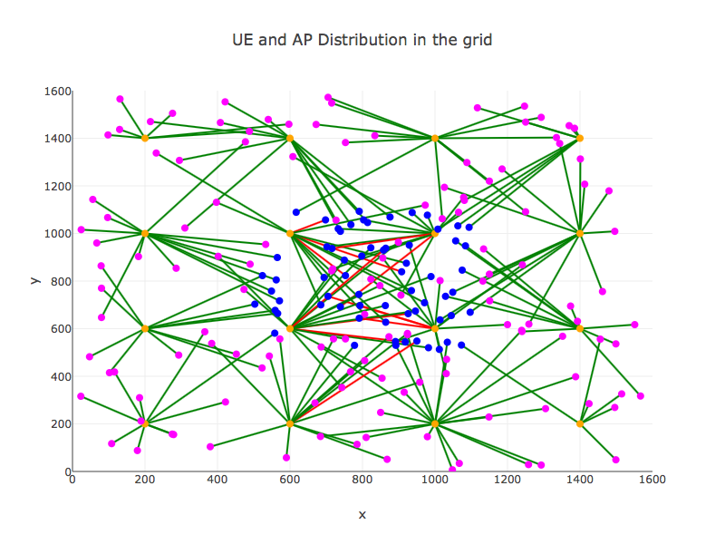
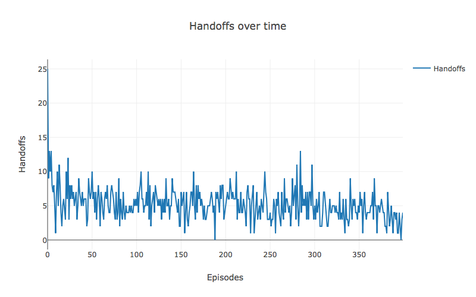
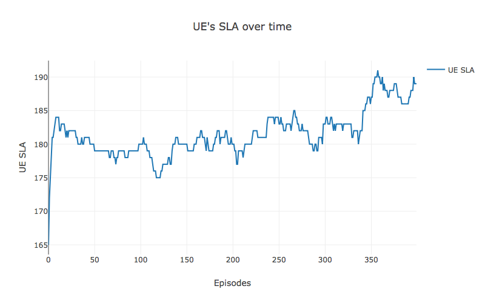

Rainman2
########

Optimizing network using Reinforcement Learning.

Dependencies
============
* Python 3.6

License
=======
Copyright 2018 Ari Saha. All rights reserved.

Authors
=======
* Ari Saha <arisaha@icloud.com>

Setup
=====
To install rainman2:

.. code-block:: bash

    $ make install-prod
    $ source venv/bin/activate

Command Line
============
Here are the commands avaiable for rainman2.

.. code-block:: bash

    (venv)$ rainman2 --help

        Using TensorFlow backend.
        Rainman2's logging has been configured!
        Usage: rainman2 [OPTIONS] COMMAND [ARGS]...

            Rainman2's cli

        Options:
        --verbose BOOLEAN      show verbose output for debugging
        --epsilon_min FLOAT    min value for epsilon to stop updating
        --epsilon_decay FLOAT  rate at which epsilon gets updated
        --epsilon FLOAT        epsilon for epsilon-greedy policy
        --gamma FLOAT          discount factor
        --alpha FLOAT          learning rate
        --episodes INTEGER     number of episodes/epochs
        --help                 Show this message and exit.

        Commands:
            Cellular  Arguments for cellular environment

Cellular Environment Experiments
================================

Cellular environments describe interactions of mobile devices (known as UEs) with cell towers (known as Access Points).

Rainman2 contains a simulated cellular environment called 'Dev' environment, which can be used to test various Reinforcement algorithms. Currently 'Dev' cellular environment supports the following algorithms:
     * Naive Qlearning, which is the generic form of Qlearning (Tabular).
     * Qlearning using linear function approximator, e.g. Linear regression.
     * Qlearning using non-linear function approximator, e.g. Neural Network.

To run experiments using Cellular network:
1) If testing on development cellular network (i.e. --env_type = Dev), first start the development server (in a new terminal tab), which will instantiate a simulated cellular network.

.. code-block:: bash

    (venv)$ cd rainman2/rainman2/lib/environment/cellular/dev

    (venv)$ python server.py

2) To start running experiments on Cellular network, use the command line as below.

.. code-block:: bash

    (venv)$ rainman2 Cellular --help

        Using TensorFlow backend.
        Rainman2's logging has been configured!
        Usage: rainman2 Cellular [OPTIONS] COMMAND [ARGS]...

            Arguments for cellular environment

        Options:
            --env_type [Dev|Prod]  type of cellular network: Dev/Prod
            --help                 Show this message and exit.

        Commands:
            qlearning_linear_regression  Qlearning with Linear Regressor as Function...

            qlearning_naive              Qlearning without any function approximator...

            qlearning_nn                 Qlearning with Neural Network as Function...

* With Tabular Q-learning algorithm

.. code-block:: bash

      (venv)$ rainman2 --verbose True --episodes 50 Cellular --env_type Dev qlearning_naive

* With Linear regression Q-learning algorithm

.. code-block:: bash

      (venv)$ rainman2 --verbose True --episodes 50 Cellular --env_type Dev qlearning_linear_regression

* With Neural network Q-learning algorithm

.. code-block:: bash

      (venv)$ rainman2 --verbose True --episodes 50 Cellular --env_type Dev qlearning_nn

.. image:: rainman2/api/static/cellular/rewards.png

